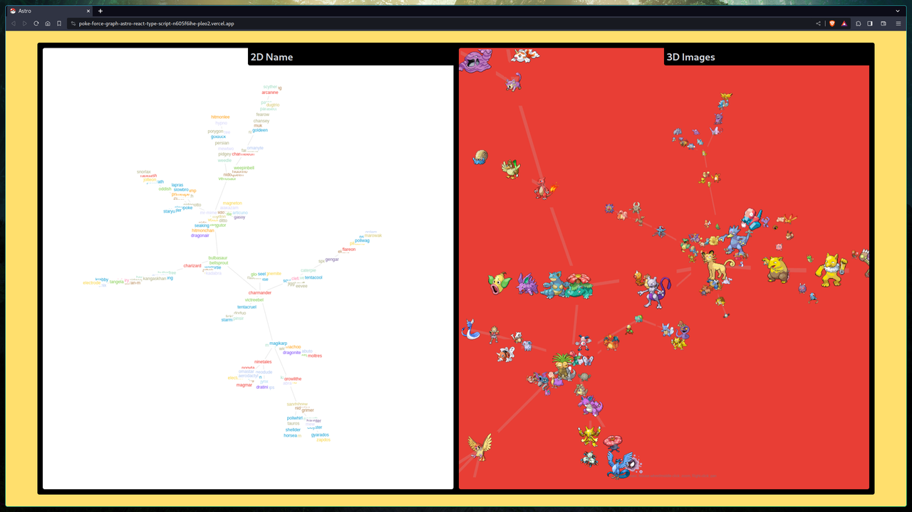

# Poke Force Graph

## Descripción

Poke Force Graph es una aplicación web que muestra un graph de fuerza de los Pokémon de la primera generación. 

## Estado

El proyecto está en desarrollo.

## Instalación y configuración

Para instalar y configurar Poke Force Graph, siga los siguientes pasos:

1. Instale los paquetes necesarios:

`pnpm install`

2. Inicie el servidor de desarrollo:

`pnpm run dev`

Abra el navegador y vaya a `http://localhost:4321`

## Contribuciones

Las contribuciones son bienvenidas. Para contribuir, siga los siguientes pasos:

Fork el repositorio.
Haga los cambios que desee.
Envíe una solicitud de extracción.

## Licencia

Poke Force Graph está licenciado bajo la licencia MIT.
